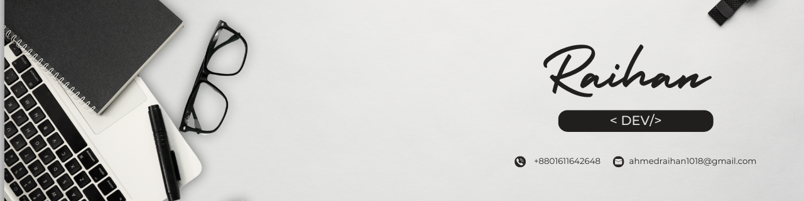

# 🚀 Hi, I'm **Raihan**

### MERN Stack Developer | Passionate About Building Modern Web Applications

  

  
  
  

---

## 🧑‍💻 About Me

I’m a **MERN Stack Developer** , passionate about creating fast, scalable, and user-friendly web applications.  
I love turning ideas into real digital products with clean UI/UX, efficient backend systems, and modern development practices.

---

## 🎯 My Goals

- Become a **Professional Full Stack Developer**
- Build visually appealing and high-performance web applications
- Grow into a full-stack MERN developer with strong backend expertise

---

## 🛠️ Tech Stack

### **Tools**

### **Backend**

### **Frontend**

### **Currently Learning**

---

## 📊 GitHub Analytics

 

  
  

---

## 🔧 Technologies I Work With

  
  
  
  
  
  

---

## 🚀 Most Used Languages

  

---

## 💬 Let's Connect

- 📧 Email: **ahmedraihan1018@gmail.com**
<!-- - 🌐 Portfolio: Coming Soon -->
- 🔗 LinkedIn: **https://www.linkedin.com/in/raihan1018/**

---

  

