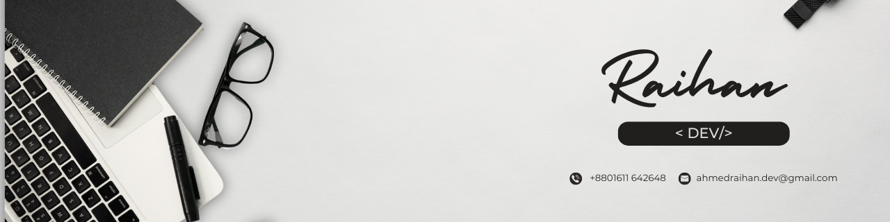

# 🚀 Hi, I'm **Raihan**

### MERN Stack Developer | Passionate About Building Modern Web Applications

  

<h2 align="center">
  
</h2>

  
  
  

---

## 🧑‍💻 About Me

👋 Hi, I’m a Full Stack Developer skilled in React, Next.js, Node.js, Express, and MongoDB.

I enjoy building responsive and user-friendly applications from both the frontend and backend.

My goal is to grow as a developer by contributing to meaningful projects & continuously learning new technologies.

📩 Let’s connect if you're:

A tech company hiring skilled developers

A developer gearing up for your next big opportunity

📬 ahmedraihan1018@gmail.com | 📞 +8801611642648

---

## 🎯 My Goals

- Become a **Professional Full Stack Developer**
- Build visually appealing and high-performance web applications
- Grow into a full-stack MERN developer with strong backend expertise

---

## 🛠️ Tech Stack

### **Tools**

### **Backend**

### **Frontend**

### **Currently Learning**

---

## 📊 GitHub Analytics

  

<a> 
    
  
   
</a>

 
 

---

## 🔧 Technologies I Work With

  
  
  
  
  
  

---

---

## 💬 Let's Connect

- 📧 Email: **ahmedraihan1018@gmail.com**
<!-- - 🌐 Portfolio: Coming Soon -->
- 🔗 LinkedIn: **https://www.linkedin.com/in/raihan1018/**

---

  

